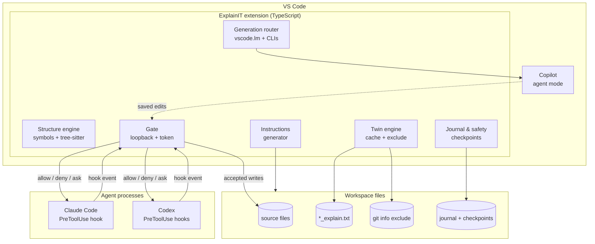
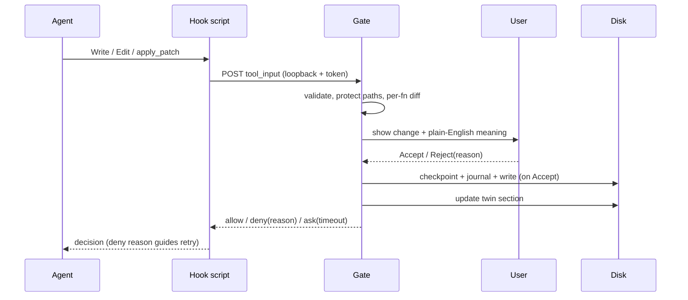

# ExplainIT — Architecture
> Approved by Baharul on 2026-09-01. Built by the Fuller pipeline. This is the source of truth for the build; goal.md is the finish line. Do not deviate without updating this file.

## What this system is
ExplainIT is a VS Code extension that keeps a second, plain-English copy of every code file — same name with `_explain` added — open beside the real one, describing each function in simple numbered notes. Whenever one of the user's AI assistants (Claude Code, Codex, Copilot) tries to change code, ExplainIT stops the change before it lands: the user sees the change and its plain-English meaning one function at a time, and only an explicit Accept lets it through, after which the English twin is updated in step. It runs entirely on the user's machine, generates explanations through the assistants the user already pays for, and keeps twin files out of GitHub. Published on the VS Code Marketplace for everyone.

## Requirements & constraints
1. Audience: everyone — VS Code Marketplace (+ Open VSX for Cursor/VSCodium).
2. Bar: real production tool for daily dependence; research depth was Ultra-Deep.
3. Explanation brain: no shipped model. The extension uses the user's connected assistants; on install it asks permission, then can backfill explains for all existing files and keep new files covered.
4. Local only: no backend, no cloud calls of our own; only localhost IPC. The only egress is the user's own assistant traffic under their existing accounts.
5. Budget: ₹0 extra — rides user subscriptions; token frugality is a feature (Copilot is metered since Jun 2026).
6. Gating: per-function Accept as the user described, via the strongest mechanism each agent permits.
7. Twin: a REAL `<name>_explain.txt` beside the source, never pushed to GitHub (local git exclude).
8. Languages: all — language-agnostic core.
9. Publishing identity: VS Code Marketplace publisher `BaharulIslam` (same namespace on Open VSX); license MIT; repo `explainit` on GitHub (Baharul0111).

Recorded assumptions: A1 tens-of-thousands-of-installs robustness (client-only; no servers). A2 users with no assistant get guided onboarding; generation unavailable until one is connected. A3 "never pushed" via `.git/info/exclude` (`*_explain.txt`), plus optional shared `.gitignore` offer. A4 function detection = DocumentSymbol → tree-sitter WASM → AI segmentation. A5 strongest mechanism per agent (hooks for Claude/Codex; review-compose for Copilot). A6 explanations in English.

## Architecture

### Structure engine
Finds every function in any language. Primary: `vscode.executeDocumentSymbolProvider` (hierarchical symbols with `range` + `selectionRange`) — https://code.visualstudio.com/api/references/commands. Wrapped in retry/backoff (≤5s) for the documented readiness race (vscode issues #100660/#169566). Fallback: `web-tree-sitter` WASM with 8 bundled grammars (py, js, ts, java, go, c, cpp, rust) — https://www.npmjs.com/package/web-tree-sitter, registerLanguage pattern per https://github.com/cursorless-dev/vscode-parse-tree. Last resort: AI segmentation through the Generation router. Emits a normalized function map `{id, name, range, contentHash}` with ranges expanded to full lines.

### Twin engine
Renders the per-function explanation contract into a real twin file beside the source, numbered exactly in the user's screenshot style. **Filename rule:** `<stem>_explain.txt` (`app.py` → `app_explain.txt`, as approved); if two files in the same folder share a stem (`index.ts` + `index.css`), those files — and only those — use the full form `<filename>_explain.txt` (`index.ts_explain.txt`) so twins never collide; covered by a test. Content-hash cache in workspace storage (unchanged functions never regenerate). Staleness marks per section when source changes without regeneration. Auto-open side-by-side on file open (toggleable) with scroll-sync. Writes the `*_explain.txt` pattern into `.git/info/exclude` per repository (local-only ignore, never committed — https://docs.github.com/en/get-started/git-basics/ignoring-files) and offers an optional shared `.gitignore` line for teams. Backfill command: whole-workspace generation with cost estimate, explicit confirm, progress, pause/resume, ≤20 functions per request.

### Generation router
One explanation contract, three channels: (1) `vscode.lm.selectChatModels` — official consent dialog, quota/`LanguageModelError` handling, reaches Copilot models and anything the user BYOK-registered (Anthropic/OpenAI/Gemini/Ollama) — https://code.visualstudio.com/api/extension-guides/ai/language-model; (2) `claude -p` headless; (3) `codex exec`. Selection = user pin → availability → error/quota fallback, logged locally. Prompts are per-channel templates with the fixed style rules; replies parse against a JSON schema with a plain-text degradation parser; re-ask budget: 1 per file. Token-thrift mode caps context (function body + minimal file summary; never whole-file dumps).

### Gate
Localhost HTTP endpoint bound to 127.0.0.1 on a random per-session port with a per-session bearer token (pattern precedent: https://github.com/Royal-lobster/code-explainer). Ingress: JSON-schema validation of hook payloads; `realpath` canonicalization; reject/ask anything outside the workspace root or escaping via symlinks; size caps. Protected-path policy (hard-deny for agent writes, with reason): `.claude/settings*.json` hook entries, `.codex/**` hooks/config, ExplainIT adapter scripts, gate token file, journal/checkpoint store, `.git/info/exclude`; writes under `.git/**` raise a prominent warning + explicit confirm. Per-function differ maps text hunks (jsdiff-class library [unverified — any equivalent]) onto the function map. Review panel follows the Cline interaction pattern (diff + decorations + blocking decision — https://github.com/cline/cline): shows the change and a fresh "what changed" explanation; Accept is enabled only after the explanation renders (Perry precondition); decisions: Accept / Reject(+reason) / Accept-file / Accept-session (decision memory fights approval fatigue); trivial hunks (whitespace/comment-only) batched; twin-only writes auto-accepted after schema validation. Hook response: allow / deny(reason) / ask.

### Agent adapters
- **Claude Code:** PreToolUse hook on `Write|Edit` returning `permissionDecision` allow/deny/ask; enforced before permission modes, even in bypassPermissions — https://code.claude.com/docs/en/hooks-guide, https://platform.claude.com/docs/en/agent-sdk/hooks. Installed BuildGuard-style (single installer, settings wiring, restart-to-arm banner, doctor/status — pattern: https://github.com/Baharul0111/BuildGuard).
- **Codex:** PreToolUse/PermissionRequest command hooks matching `apply_patch` (Write/Edit equivalent), installed at the **user layer** so repo-editing agents can't silently drop it; project hooks load only after repo trust — https://doc.jarvisuni.com/openai/codex/hooks.html, https://github.com/openai/codex/blob/main/docs/config.md, deployment precedent https://docs.endorlabs.com/agent-governance/codex/index.
- **Copilot:** no external hook system exists → compose with its native keep/undo review + checkpoints (https://learn.microsoft.com/en-us/visualstudio/ide/copilot-agent-mode); a saved-change watcher overlays per-function explanations; `.github/copilot-instructions.md` steers function-by-function edits and twin upkeep. Documented honestly as review-compose, not pre-write block.
- **Claude Code and Codex VS Code extensions (added 2026-09-02 by Baharul):** both extensions bundle the same engines as the CLIs — `anthropic.claude-code` ships `resources/native-binary/claude` and runs it with the user's `~/.claude/settings.json` hooks; `openai.chatgpt` ships `bin/<platform>/codex` and runs it as an app-server that loads `~/.codex/config.toml` hooks. Therefore the user-layer PreToolUse hooks above gate edits made from inside the editor exactly as they gate the terminal tools (verified by conformance tests that drive the bundled binaries). Detection treats an installed extension as a connected assistant, and the Generation router uses the bundled binary as the `claude -p` / `codex exec` channel when no CLI is on PATH. Codex hook trust is recorded in `config.toml` `[hooks.state]` and is shared by the CLI and the extension; onboarding tells the person to approve the ExplainIT hook once, and the doctor checks the trust record for both paths.
- **Hook watchdog:** every hook script self-times-out (default 120s, configurable) → returns **ask** with "ExplainIT unresponsive", so a wedged extension degrades to the agent's own approval prompt, never a hang and never a silent bypass. Doctor verifies adapter script + hook-config integrity by hash each session and re-arms if tampered.

### Journal & safety
Append-only per-workspace change journal (proposed content, decision, before/after hashes, timestamps) — the agent is never the only witness (Replit doctrine: https://datapace.ai/blog/replit-database-deletion-control-plane). Checkpoint before every accepted write; one-click restore; doctor includes a checkpoint→restore round-trip self-test. Kill-switch command ("Pause ExplainIT gating") flips hooks to allow with a persistent banner. Status-bar heartbeat. Rotation caps on journal/checkpoints. No telemetry; all logs local (Output channel + rolling file).

### Instructions generator
Writes/updates sections in `CLAUDE.md`, `AGENTS.md`, `.github/copilot-instructions.md`: edit one function at a time; after an accepted change, update the twin section; create a twin for every new file. Steering on top of enforcement, never instead of it.

## Models
No shipped weights — model choice is delegated to the user's assistants, which is also the quality-optimal choice: frontier assistant models lead the only functional explanation benchmark by a wide margin (best small permissive model 35.1% HumanEvalExplain — https://arxiv.org/pdf/2405.19032). Channels: vscode.lm (Copilot family + BYOK incl. Ollama) | Claude (user's plan via `claude -p`) | Codex (GPT-5.x-Codex via `codex exec`). Fallback = another connected channel. Quality is measured, not vibed: the repo ships a HumanEvalExplain-subset round-trip eval (explain → resynthesize → pass@1) per channel — method https://arxiv.org/abs/2308.07124, harness base https://github.com/bigcode-project/octopack (MIT).

## Data flows

Reading flow, numbered: (0) one-time permission (vscode.lm consent or one-click adapter install + restart). (1) User opens a file, or runs Backfill (estimate + confirm). (2) Structure engine yields the function map. (3) Cache check — unchanged functions skip AI. (4) Router has the user's assistant write English per contract. (5) Twin opens beside code, scroll-synced, numbered. (6) `.git/info/exclude` keeps twins off GitHub. Loop: later edits mark sections stale → step 4. Change flow, numbered: (A) agent proposes a write; (B) hook intercepts pre-disk (Claude/Codex); (C) gate validates + splits per function; (D) change + meaning shown (generated via steps 3–4 machinery); (E) decision with session memory; (F) on Accept: checkpoint → journal → write → twin update; Reject returns the reason to the agent; gate timeout falls back to the agent's own ask. Copilot: native keep/undo + watcher overlay + instructions steering.

## Data model
| Entity | Fields (essence) | Notes |
|---|---|---|
| FunctionRecord | id, fileUri, name, range, contentHash | from Structure engine; ranges full-line |
| Explanation | functionId, summary(1 sentence), steps(2–5 short), warnings?, uncertainty?, modelChannel, createdAt | schema-validated before disk |
| TwinFile | fileUri, twinUri, sectionMap(functionId→lines), staleSections[] | rendered numbered format |
| CacheEntry | contentHash → Explanation | workspace storage |
| GateRequest | id, agent, toolName, targetPath(canonical), proposedContent, hunks[] | validated ingress |
| Decision | requestId, verdict(accept/reject/ask/auto), reason?, scope(one/file/session), decidedAt | feeds journal + memory |
| JournalEntry | append-only: request, decision, beforeHash, afterHash, ts | versioned format |
| Checkpoint | fileUri, contentSnapshot, ts | pre-accept; rotation-capped |
| AdapterState | agent, installed, armed, configHash, lastHeartbeat | doctor reads |
| Settings | channel pin, auto-open, thrift mode, watchdog secs, batching, kill-switch | VS Code settings |

## Security, safety & guardrails
No accounts, no server, loopback-only networking with per-session random port + bearer token (never logged). Ingress validation: JSON schema, realpath canonicalization, workspace confinement, size caps; child processes use arg arrays (no shell interpolation of agent strings). Self-tamper protection: protected-path hard-denies + config/script integrity hashes verified by doctor; Claude hook deny holds even in bypassPermissions; Codex hook at user layer. Prompt-injection defense: file content is fenced as untrusted data with a fixed never-follow-instructions rule; red-team fixtures in the conformance suite; twin output is plain text, schema-validated, never executed, and never influences gate decisions. Human-in-the-loop: Accept gated on rendered explanation; strict defaults; decision memory is opt-in loosening. Data protection: everything local; journal append-only and tamper-evident (hash chain); checkpoints + tested restore; RPO = last accepted change, RTO = one click. Resilience: timeouts on every external call, single retry with jitter, capped long-poll (25s re-poll), hook watchdog → ask, heartbeat + red status warning. Kill switch command. Consent screen states verbatim: code goes only to the assistants you already use, under your existing agreements. No telemetry.

## Scaling plan & cost
Infra ₹0/month — client-only. Generation rides user subscriptions (Copilot metered credits; Claude plans; ChatGPT/Codex). Token frugality: hash cache, per-function regeneration, thrift mode, backfill estimates. At 10× installs nothing changes server-side; what breaks first is agent-version churn (hook schema drift — e.g. claude-code precedence fix v2.1.77) → per-agent conformance CI pinned to agent versions + Marketplace pre-release canary channel. VSIX size budget: top-8 grammars only; AI segmentation covers the rest. Performance budgets (design constants): twin open <300ms p95 cache-hit; first explanation streamed <8s; gate panel <500ms after hook event; symbol backoff cap 5s; backfill ≤20 functions/request.

## Production gate result
**Passed in 2 rounds** (round 1: 1 blocker — agent self-tamper — plus 4 majors: payload validation, injection mechanism, timeouts, restore self-test; all absorbed into this file). Open MINORs belong to the final hardening pass of the build (goal.md build order, step 9): dependency/CodeQL scanning + adapter security review; perf budgets + fixture-monorepo load test; structured local logs + doctor checks + 5 runbooks. Accepted risks: (i) Copilot path is review-compose, not pre-write block — revisit if Copilot ships a gating API; (ii) BYOK-Ollama offline rung rides a preview feature — documented as convenience; (iii) hook schema churn — mitigated by pinned-version conformance CI.

## Requirement register
Every id below must be implemented and proven by automated tests; goal.md's definition of done is checked against this list.

| id | requirement |
|---|---|
| REQ-001 | Extension scaffold: esbuild-bundled, lazy activation, all disposables cleaned up |
| REQ-002 | Structure engine: DocumentSymbol with readiness retry/backoff (<=5s) |
| REQ-003 | Twin file `<stem>_explain.txt` (full-filename form only on stem collision) created beside the source, numbered per function, auto-opened side-by-side with toggle |
| REQ-004 | `*_explain.txt` written to `.git/info/exclude` so twins never reach GitHub |
| REQ-005 | Explanation contract (1-sentence summary + 2-5 short plain steps) rendered in the approved screenshot format |
| REQ-006 | vscode.lm channel with user-initiated consent dialog and quota/LanguageModelError handling |
| REQ-007 | `claude -p` and `codex exec` channels via arg-array child processes with timeouts and single jittered retry |
| REQ-008 | Content-hash cache + token-thrift: unchanged functions never regenerate |
| REQ-009 | Injection fencing: source content treated as untrusted data; red-team fixtures stay descriptive |
| REQ-010 | Staleness marks per section, one-click regenerate, source-twin scroll-sync |
| REQ-011 | Backfill with cost estimate, explicit confirm, progress, pause/resume, <=20 functions/request |
| REQ-012 | tree-sitter WASM fallback (8 grammars, lazy) + AI segmentation last resort |
| REQ-013 | Loopback gate: 127.0.0.1 random port, session token, schema validation, realpath confinement, protected-path hard-deny |
| REQ-014 | Per-function review: Accept enabled only after explanation renders; Reject with reason; decision memory; trivial-hunk batching |
| REQ-015 | Hash-chained journal + checkpoint before every accepted write + one-click restore with round-trip self-test |
| REQ-016 | Claude Code adapter: PreToolUse Write-and-Edit gate, 120s watchdog to ask, doctor integrity hashes |
| REQ-017 | Codex adapter (user-layer apply_patch hooks) + pinned-version conformance CI + CLAUDE.md/AGENTS.md instruction sections |
| REQ-018 | Copilot compose path: saved-change watcher overlay on native keep/undo + copilot-instructions steering |
| REQ-019 | Resilience and first-run: kill switch, heartbeat, no-agent onboarding, doctor checks, designed failure states |
| REQ-020 | Eval harness: HumanEvalExplain-subset round-trip per channel + CI regression floor |
| REQ-021 | Hardening and release: scanners + adapter security review, perf budgets and load test, Marketplace + Open VSX publish |
| REQ-022 | VS Code extension paths: Claude Code and Codex extensions detected as assistants (bundled binaries usable as channels), gated by the same user-layer hooks, doctor verifies both paths, conformance tests drive the bundled binaries |

## Non-goals — what this deliberately will NOT include
- No backend, server, account system, or telemetry: the extension makes no network calls of its own, ever.
- No shipped or bundled AI model and no API keys of ours; generation happens only through the user's already-connected assistants.
- Never commit or push `*_explain.txt`, and never edit the team's shared `.gitignore` automatically.
- No watch-and-revert as the primary gate and no silent auto-accept of code changes: Accept stays human and per-function by default.
- No webview-only explanations in place of the real twin files.
- Never weaken the protected-path denies, the explanation-before-Accept rule, or the untrusted-data fencing to make development or tests easier.

## Alternatives rejected
Own model/API key (violates local/₹0; quality worse than delegated frontier). Watch-and-revert as primary gate (fights agents; enforcement must live pre-write — Replit doctrine); retained only as Copilot annotator. Webview-only explanations (not real files — requirement #7). Editing shared `.gitignore` (pollutes team repo) vs `.git/info/exclude`. Single-agent product (requirement #3 names three). From-scratch review UI (Cline pattern proven at ~5M installs).

## Sources
Verified: vscode.lm guide; VS Code commands/DocumentSymbol + issues #100660/#169566/#11587; Claude Code hooks (code.claude.com, platform.claude.com) + issues #33932/#35136/#41791; Codex hooks + config + approvals (openai/codex docs, developers.openai.com, Endor Labs); Copilot agent mode (MS Learn), instructions GA (GitHub changelog), open-sourcing (VS Code blog); .git/info/exclude (GitHub Docs, Atlassian); publishing (VS Code docs, Open VSX); Cline (3 independent 2026 sources); code-explainer; BuildGuard; web-tree-sitter; OctoPack/HumanEvalExplain (arXiv 2308.07124 + repo); Leinonen ITiCSE'23 (10.1145/3587102.3588785); MacNeil SIGCSE'23; Perry CCS'23 (10.1145/3576915.3623157); Xia TSE 2018 (10.1109/TSE.2017.2734091 — 78 professionals, 3,148 hours, ~58% comprehension); SO-2025 survey; METR RCT; GitClear; Replit incident writeups. [unverified]: jsdiff npm page (non-critical — any diff lib).
